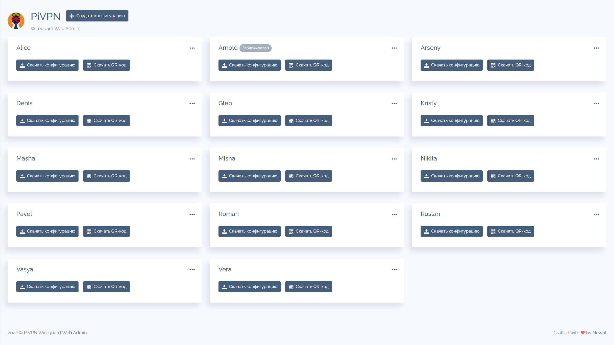
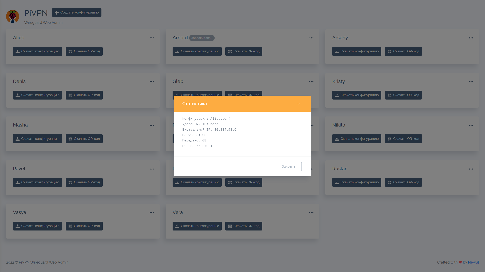

# PiVPN Wireguard Web Admin

Простой веб-интерфейс для администрирования PiVPN Wireguard.

## Зависимости

 - Для генерации QR-кодов требуется **PHP-GD** для Вашей версии php `sudo apt install phpX.X-gd`
 - Для чтения конфигураций требуется создать симлинк папки конфигураций в папке с сайтом `ln -s /home/<wg user>/configs/ /var/www/<you site folder>/configs`
 - Для выполнения команд PiVPN веб-сервером требуются права sudo без ввода пароля для пользователя www-data `echo "www-data ALL=(ALL) NOPASSWD:ALL" | tee -a /etc/sudoers`
 - Для возможности чтения конфигураций требуются права 755 для папки и 644 для самих конфигураций `chmod 755 /var/www/<you site folder>/configs` `chmod 644 /var/www/<you site folder>/configs/*.conf`

## Автооризация

Для авторизации используется Basic authentication Вашего веб-сервера. Для Apache2: Создание файла пользователей `sudo htpasswd -c /etc/apache2/.htpasswd <user name>`
Включение авторизации в конфигурации:

    <Directory "/var/www/<you site folder>">
        AuthType Basic
        AuthName "Restricted Content"
        AuthUserFile /etc/apache2/.htpasswd
        Require valid-user
    </Directory>

## Возможности

 - Создание конфигураций
 - Блокировка конфигураций
 - Разблокировка конфигураций
 - Скачивание конфигураций
 - Скачивание QR-кодов в png
 - Удаление конфигураций
 - Просмотр статистики

 ## Лицензия

 [MIT License](https://codeberg.org/rkozlov/pivpn-wireguard-webadmin/src/branch/main/LICENSE)